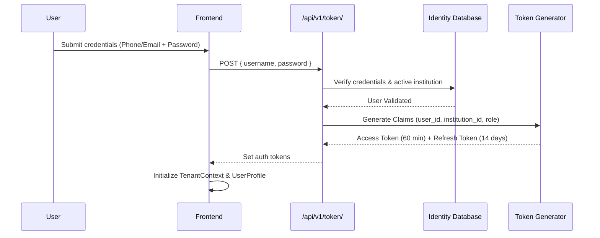

# Authentication, Authorization & Identity Architecture

**Document Version:** 1.0.0  
**Authentication Engine:** Django REST Framework SimpleJWT + Google Identity Services  

---

## 1. Authentication Lifecycle

---

## 2. Token Lifetime & Security Policies

1. **Access Token Lifetime:** 60 minutes (`ACCESS_TOKEN_LIFETIME = timedelta(minutes=60)`).
2. **Refresh Token Lifetime:** 14 days (`REFRESH_TOKEN_LIFETIME = timedelta(days=14)`).
3. **Sliding Rotation:** Every refresh request issues a fresh refresh token and invalidates the previous token (`ROTATE_REFRESH_TOKENS = True`).
4. **Token Blacklisting:** Revoked refresh tokens are persisted in `django_rest_framework_simplejwt.token_blacklist` to prevent replay attacks (`BLACKLIST_AFTER_ROTATION = True`).
5. **Cryptographic Algorithm:** HMAC-SHA256 with 64-character high-entropy secret key.

---

## 3. Social Identity Integration (Google OAuth2)

- Frontend utilizes `@react-oauth/google` with dynamic client credentials strictly bound to `import.meta.env.VITE_GOOGLE_CLIENT_ID`.
- Backend verifies the Google identity payload at `/api/v1/auth/google/` via `google-auth` token verification libraries, mapping identity to the target institutional tenant.
