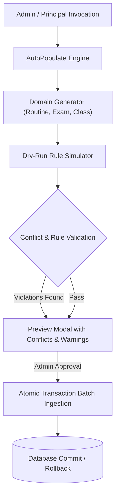

# AutoPopulate & Routine Automation Engine Architecture

**Document Version:** 1.0.0  
**Subsystems:** Declarative Rule Generator, Conflict Detector, Dry-Run Simulator  

---

## 1. Declarative AutoPopulate Paradigm

TaleemOS features a powerful declarative automation subsystem (`frontend/src/utils/auto-populate/` and `backend/core/legacy_services.py`) designed to eliminate hours of manual administrative entry for timetables, examination routines, and class setups.

---

## 2. Workload Balancing & Conflict Detection Rules

1. **Teacher Multi-Booking Defense:** A single faculty member cannot be scheduled for two concurrent class periods across different rooms/classes simultaneously.
2. **Room Allocation Exclusivity:** A physical classroom/laboratory cannot host multiple concurrent sections unless explicitly designated as combined.
3. **Weekly Period Constraints:** Respects daily and weekly period quotas per subject and teacher workload thresholds.
