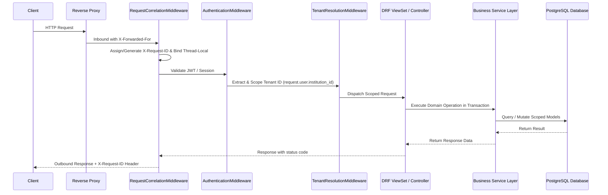

# Backend Architecture Specification

**Document Version:** 1.0.0  
**Target Subsystem:** Enterprise API Service (`backend/core/`)  
**Stack:** Python 3.12, Django 5.x, Django REST Framework, SimpleJWT  

---

## 1. Request Lifecycle & Middleware Pipeline

Every HTTP request dispatched to the TaleemOS backend traverses an ordered, security-hardened middleware pipeline:



---

## 2. Service Layer Decoupling

To prevent fat models and congested controllers, business operations are segregated into dedicated service modules:
- `backend/core/services/audit_service.py`: Centralized immutable audit trail generation and state diffing.
- `backend/core/legacy_services.py`: Academic transfer operations, batch promotion, routine conflict analyzers.
- `backend/core/views/`: DRF ViewSets restricted to HTTP protocol handling, parameter deserialization, and status formatting.

---

## 3. Centralized Exception Handling & Masking

In `backend/core/exceptions.py`, `custom_exception_handler` intercepts all API exceptions:
- Injects correlation `request_id` into all error payload dictionaries.
- Masks raw internal server errors (500) to prevent stack trace leaks in production.
- Emits structured error logs capturing endpoint, method, user ID, tenant ID, and stack trace.

```json
{
  "detail": "An internal server error occurred. Please contact system support with reference Request ID.",
  "request_id": "8c6719f8-0d9b-4b1f-8eaf-83100a212f45"
}
```
