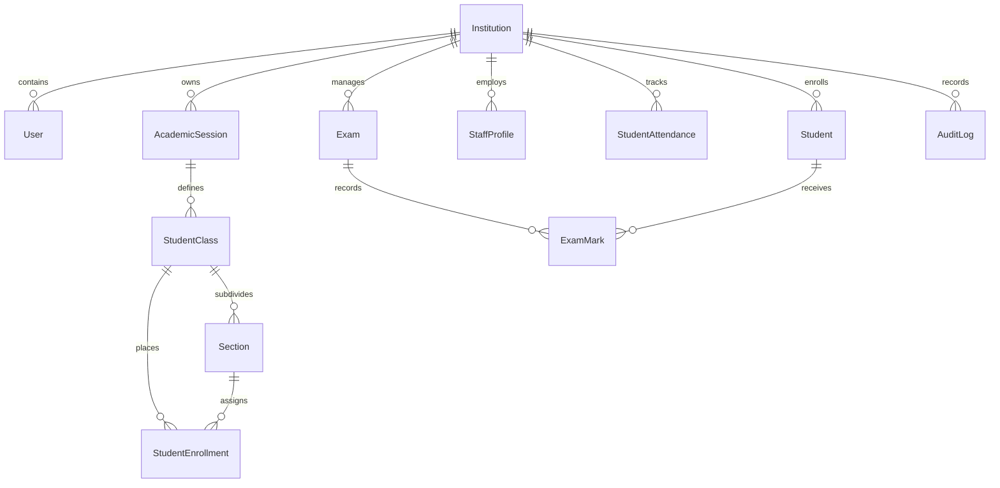

# Database Schema, Integrity & Indexing Architecture

**Document Version:** 1.0.0  
**Target Subsystem:** PostgreSQL Database & Django ORM Models  
**Classification:** Enterprise Data Tier Specification  

---

## 1. Multi-Tenant Relational Topology

TaleemOS operates on a **Shared-Database, Discriminator Column (Row-Level)** multi-tenancy model. Every tenant-scoped table maintains a mandatory foreign key referencing `Institution`.

---

## 2. Integrity Constraints

### 2.1 Multi-Tenant Uniqueness Constraints
- `Student`: `UniqueConstraint(fields=['institution', 'uniq_id'], name='uq_student_institution_uniq_id')`
- `StudentClass`: `UniqueConstraint(fields=['institution', 'academic_year', 'name'], name='uq_class_tenant_year_name')`
- `Section`: `UniqueConstraint(fields=['student_class', 'section_name'], name='uq_section_class_name')`
- `DormitoryBed`: `UniqueConstraint(fields=['room', 'bed_number'], name='uq_bed_room_number')`

### 2.2 Domain Check Constraints
- `CalendarEvent`: `CheckConstraint(check=Q(end_date__gte=F('start_date')), name='chk_event_dates_valid')`
- `StaffLeave`: `CheckConstraint(check=Q(end_date__gte=F('start_date')), name='chk_leave_dates_valid')`
- `DailyLessonEvaluation`: `CheckConstraint(check=Q(score__gte=0) & Q(score__lte=100), name='chk_lesson_score_range')`

---

## 3. High-Performance Indexing Strategy

All database indexes are deliberately positioned on high-cardinality multi-tenant access paths:

| Model | Index Name | Indexed Fields | Query Access Pattern |
|---|---|---|---|
| `AuditLog` | `idx_audit_inst_created` | `['institution', '-created_at']` | Tenant audit trail pagination |
| `AuditLog` | `idx_audit_resource` | `['institution', 'resource_type', 'resource_id']` | Entity change history lookup |
| `StudentAttendance` | `idx_att_inst_date` | `['institution', 'date', 'status']` | Daily institutional headcount radar |
| `ExamMark` | `idx_mark_exam_subject` | `['exam', 'subject', 'student']` | Mark entry grid & tabulation ledger |
| `RoutinePeriod` | `idx_routine_lookup` | `['institution', 'day_of_week', 'period_slot']` | Conflict detection & scheduling |
