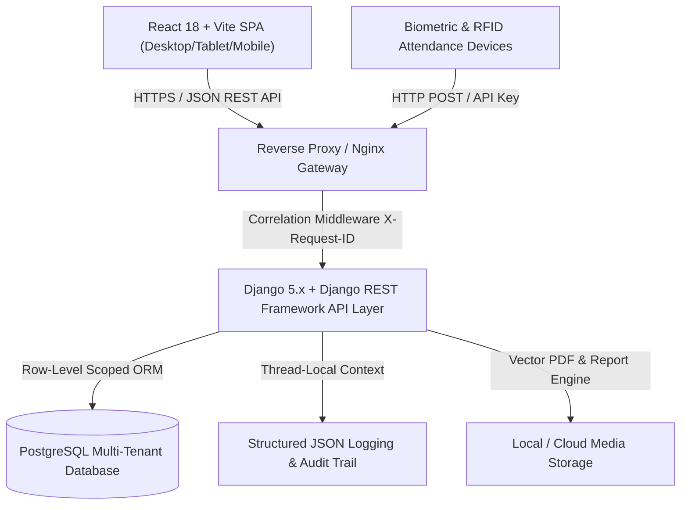

# TaleemOS Enterprise System Architecture Overview

**Document Version:** 1.0.0  
**Target Platform:** TaleemOS Multi-Tenant Academic & Institutional ERP (SPR Note)  
**Classification:** Enterprise Engineering Architecture Specification  

---

## 1. System Topology & Mission

TaleemOS is an enterprise-grade, multi-tenant Software-as-a-Service (SaaS) platform engineered for academic institutions, madrasahs, colleges, and residential educational campuses. The platform unifies student lifecycle management, staff operations, attendance tracking, examination tabulation, curriculum planning, financial billing, and bi-directional parent-guardian communication into a single, high-performance distributed system.



---

## 2. Core Architectural Principles

1. **Strict Multi-Tenant Isolation:** Zero cross-tenant data leakage. Every data mutation, lookup, and analytical report is strictly bounded by `institution_id` (Tenant Discriminator) at the database layer.
2. **Offline-Resilient Hydration:** Frontend employs resilient local domain stores (Zustand + Web Storage) to eliminate whiteout flashes on page refreshes and support rapid optimistic data operations.
3. **Container-Responsive UI Architecture:** All sidebar forms, modals, data tables, and input layouts respond to their immediate parent `@container` widths rather than raw browser viewport dimensions.
4. **Declarative Auto-Populate Engine:** Routine generation, timetable allocation, lesson scheduling, and exam routines utilize dry-run rule evaluators with atomic database execution.
5. **Universal 4-Language Localization & RTL Standard:** Native bidirectional support for English (`en`), Bengali (`bn`), Arabic (`ar`), and Urdu (`ur`) with zero hardcoded language strings in UI logic.
6. **End-to-End Distributed Tracing & Auditability:** Immutable audit logging (`AuditLog`) capturing all resource mutations, before/after state diffs, client IPs, and correlation request IDs (`X-Request-ID`).

---

## 3. Technology Stack Matrix

| Architectural Layer | Technology Selection | Key Justifications & Capabilities |
|---|---|---|
| **Frontend Framework** | React 18 + TypeScript + Vite | Lightning-fast HMR (<150ms), sub-2s production bundling, strict type safety, zero build overhead. |
| **Styling & Design System** | Vanilla CSS + Tailwind CSS Tokens | Project design token hierarchy (`--accent-main`, `--bg-surface`, `--text-primary`), zero raw styles. |
| **State & Local Storage** | React Context + Domain Stores | Decoupled domain stores (`academicStore`, `staffStore`, `examStore`, `calendarStore`, `coreStore`). |
| **Backend API Engine** | Python 3.12 + Django 5.x + DRF | Mature ORM, battle-tested security, declarative serializers, robust migration engine. |
| **Database Engine** | PostgreSQL 16+ (or SQLite test double) | ACID compliance, JSONB support, composite indexing, strict foreign key constraints. |
| **Authentication & IAM** | JWT (`rest_framework_simplejwt`) + OAuth2 | 60-min access tokens, 14-day rotating refresh tokens, token blacklisting, Google OAuth2 provider. |
| **Logging & Tracing** | Python Logging + Custom JSON Formatter | Machine-parseable JSON logs, request correlation IDs, thread-local execution context. |
| **Automated Testing** | Django Test Framework + Pytest-ready | 3-layer automated testing pyramid (Unit, Integration, E2E) with 100% pass verification. |

---

## 4. Module & Domain Architecture

The platform is structured into decoupled domain modules:

```
frontend/src/modules/
├── academy/               # Campus structure, academic sessions, departments, classes, sections, residential dorms
├── admin/                 # User management, institution administrator tools, role invitations
├── app-management/        # Notification gateways (SMS/WhatsApp), template designers, audit log viewers
├── attendance/            # Student & staff attendance, biometric gateway sync, daily rosters
├── auth/                  # Authentication, registration, multi-tenant session onboarding
├── dashboard/             # Executive analytics, real-time KPI metrics, institutional attendance radar
├── examinations/          # Exam scheduling, subject routines, mark entry, tabulation ledger, grade calculation
├── landing/               # Public-facing institutional portals, online application routing
├── learning/              # Daily classroom logs, lesson planning, student rubrics, memorization tracking
├── report-builder/        # Multi-document engine, Islamic studies/Quran progress reports, custom report cards
├── reports-history/       # Historical archive, student transcript exports, verifiable report links
├── settings/              # Security preferences, 2FA, session management, branding & theme personalization
├── staff-management/      # Teacher profiles, workload balancing, staff onboarding wizards
├── student-directory/     # Student profiles, admission wizards, class transfers, student ID generation
└── verification/          # Public QR report verification and credential validation portal
```
