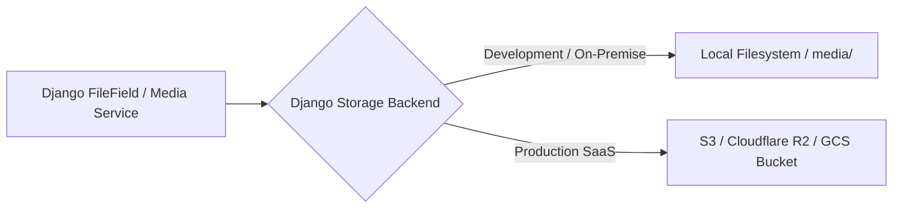

# Media & Document Storage Architecture

**Document Version:** 1.0.0  
**Storage Engine:** Pluggable Media Storage Provider (Local Disk / AWS S3 / Cloudflare R2)  

---

## 1. Storage Abstraction Layer

TaleemOS abstracts binary file operations (student profile photos, institutional logos, scanned admission documents, template banners, vector PDF exports) behind a pluggable storage interface:



---

## 2. File Upload Security Policies

1. **Extension & MIME Validation:** Inbound file uploads pass strict file signature inspection (`python-magic` / MIME headers) to prevent execution of malicious shell scripts or executables.
2. **File Name Sanitization:** Uploaded files are renamed using deterministic cryptographic hashes (e.g. `uuid4().hex`) and partitioned into tenant-specific directory paths:
   ```
   media/tenants/{institution_id}/students/{student_uuid}/avatar.jpg
   media/tenants/{institution_id}/reports/{report_code}.pdf
   ```
3. **Serving Security:** Media files are served with `X-Content-Type-Options: nosniff` and appropriate `Content-Disposition` headers to eliminate browser MIME-confusion vulnerabilities.
