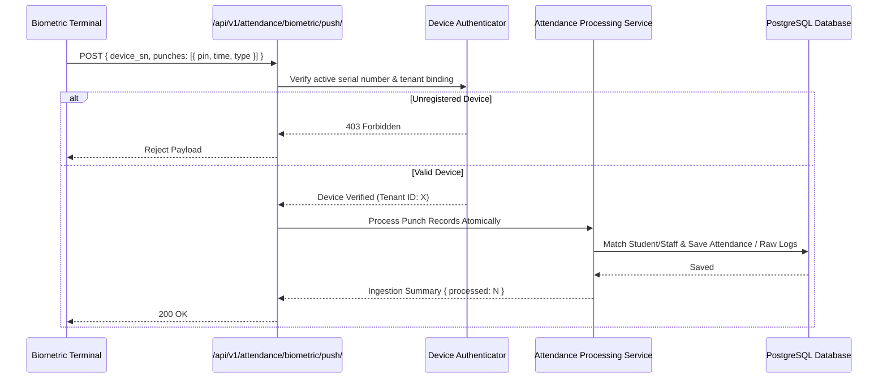

# Realtime Attendance & Sync Engine Architecture

**Document Version:** 1.0.0  
**Subsystems:** Biometric Push Gateway, Real-Time Polling & WebSocket Radar, Local Cache Hydration  

---

## 1. Biometric Push Gateway Ingestion

TaleemOS supports direct, real-time punch ingestion from physical biometric terminals (ZKTeco, Hikvision, RFID readers):

---

## 2. Frontend Real-Time Attendance Radar

The frontend dashboard and classroom views maintain live synchronization via `useRealtimeAttendance`:
- Subscribes to custom browser events (`spr_attendance_updated`).
- Employs exponential backoff polling during active class session intervals.
- Optimistically updates attendance indicators (Present, Absent, Late, Leave) with zero UI lag.
