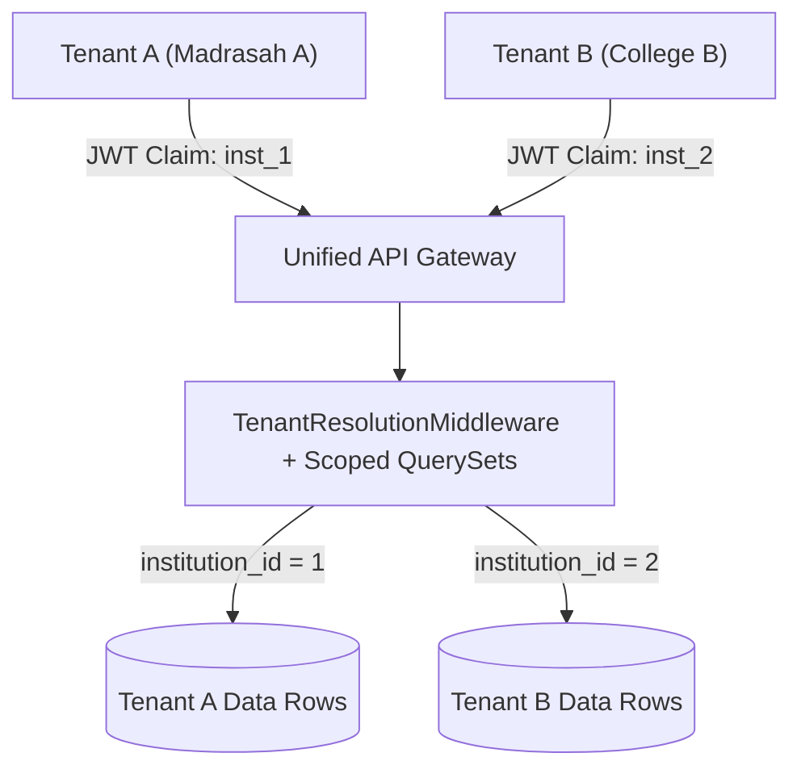

# Multi-Tenant Isolation & Tenancy Architecture

**Document Version:** 1.0.0  
**Model:** Shared Database with Discriminator Column (Row-Level Multi-Tenancy)  
**Security Status:** Audited & Zero Cross-Tenant Leakage Enforced  

---

## 1. Tenancy Model Overview

TaleemOS serves thousands of distinct academic institutions from a single unified codebase and database cluster. Each institution represents an independent Tenant boundary:



---

## 2. Tenant Resolution Strategy

Tenant context is resolved at the middleware tier via `TenantResolutionMiddleware` with the following precedence:
1. **Authenticated User Binding:** `request.user.institution_id` from the verified JWT claims payload.
2. **Administrative Override (SuperAdmin Only):** `X-Institution-ID` HTTP header or `?institution_id=` query parameter (strictly forbidden for non-superusers).
3. **Public Ingestion Bindings:** Device serial identification or verified public registration tokens.

---

## 3. QuerySet Scoping Enforcement

All DRF ViewSets inherit from custom base classes or implement explicit `get_queryset()` filtering:

```python
def get_queryset(self):
    tenant_id = get_scoped_tenant_id(self.request)
    if not tenant_id:
        return Model.objects.none()
    return Model.objects.filter(institution_id=tenant_id)
```

### Boundary Test Verification:
Every business domain contains automated tests (`core.tests_tenant_isolation`) verifying that:
- Tenant A cannot view Tenant B's data (`GET` returns 404 Not Found).
- Tenant A cannot modify Tenant B's data (`PUT`/`PATCH` returns 404/403).
- Tenant A cannot delete Tenant B's data (`DELETE` returns 404/403).
- Tenant A cannot search Tenant B's student or staff records.
