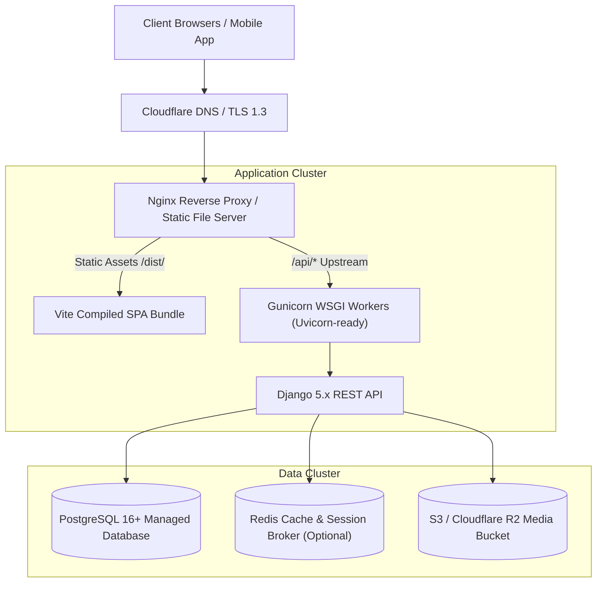

# Production Deployment & Infrastructure Guide

**Document Version:** 1.0.0  
**Target Environments:** Railway, AWS ECS / EC2, Docker, Bare Metal Linux  

---

## 1. Production Topology



---

## 2. Deployment Commands & Checklist

### 2.1 Backend Build & Migration
```bash
# 1. Activate virtual environment
source venv/bin/activate

# 2. Install production dependencies
pip install -r requirements.txt

# 3. Apply all pending database migrations
python manage.py migrate --noinput

# 4. Collect static files for Django Admin / API Docs
python manage.py collectstatic --noinput

# 5. Launch Gunicorn WSGI Server
gunicorn core.wsgi:application --bind 0.0.0.0:8000 --workers 4 --threads 2 --timeout 60
```

### 2.2 Frontend Production Compilation
```bash
cd frontend
npm ci
npm run typecheck
npm run build
# Compiled bundle outputs to frontend/dist/
```
