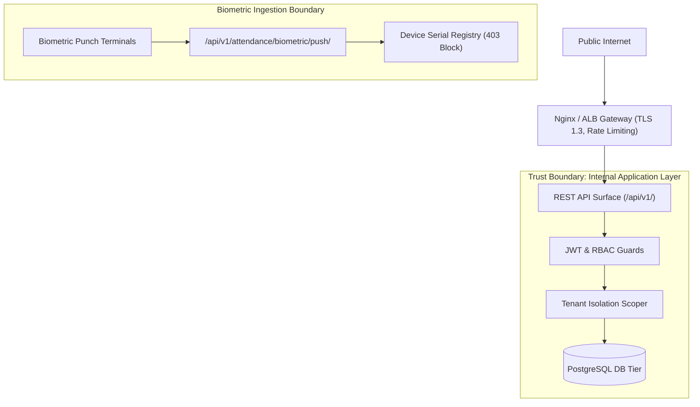

# Enterprise Security Threat Model (STRIDE)

**Document Version:** 1.0.0  
**Methodology:** Microsoft STRIDE Threat Modeling Framework  
**Scope:** TaleemOS Multi-Tenant Architecture  

---

## 1. STRIDE Threat Assessment & Mitigations

| Threat Category | Potential Risk Vector | TaleemOS Architectural Mitigation | Verification Standard |
|---|---|---|---|
| **Spoofing (Identity)** | Forged JWT tokens or spoofed tenant claims | Cryptographically signed HMAC-SHA256 tokens with 64-char key; strict token blacklisting on logout/rotation. | `core.tests_tenant_isolation` |
| **Tampering (Data)** | Unauthorized modification of grades, attendance, or student records | Mandatory authentication, fine-grained RBAC on ViewSets, database check constraints, immutable `AuditLog`. | `core.tests_database_integrity` |
| **Repudiation** | User denies performing a destructive action (e.g. deleting attendance) | Centralized `AuditLog` captures actor ID, IP address, user-agent metadata, before/after diffs, and `X-Request-ID`. | `core.tests_observability_audit` |
| **Information Disclosure** | Cross-tenant data leakage or debug stack trace leakage | ORM querysets strictly filtered by `institution_id`; custom DRF exception handler masks 500 errors in production. | `core.tests_tenant_isolation` |
| **Denial of Service** | Unbounded database queries or bulk ingestion lockups | Mandatory API pagination (`page_size=50`); atomic rollback with indexed query paths. | Performance benchmarking |
| **Elevation of Privilege** | Regular staff / teacher invoking administrative endpoints | Strict DRF permission classes (`IsInstitutionAdmin`, `IsSuperUser`) enforced on mutation handlers. | `core.tests_integration_pipeline` |

---

## 2. Attack Surface Analysis

