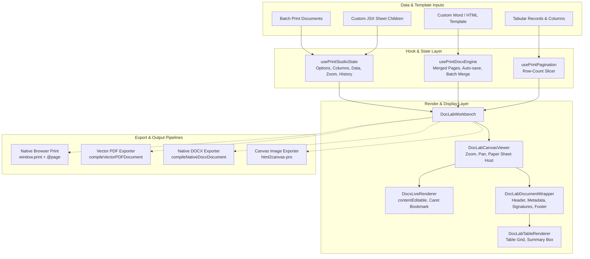
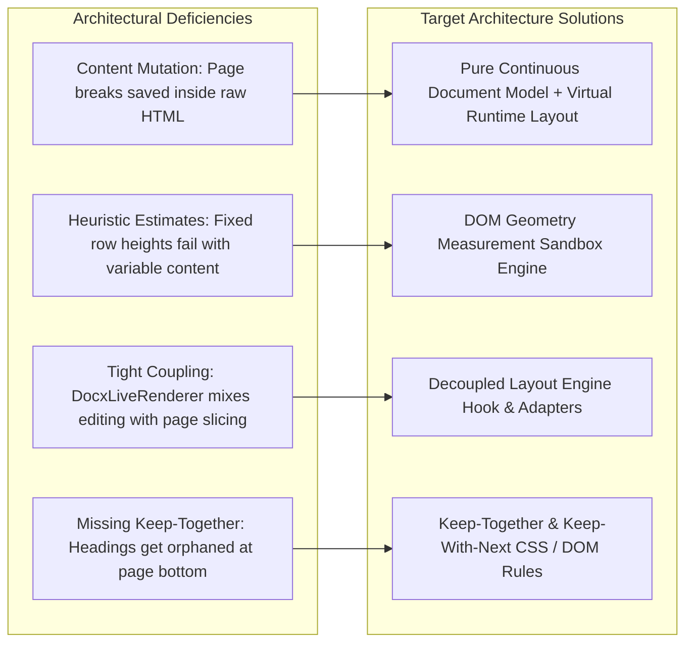
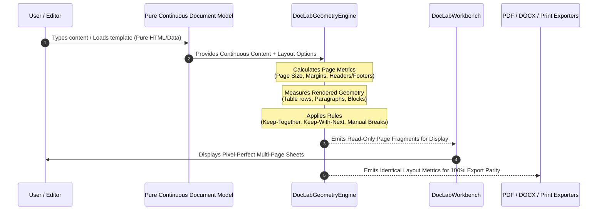
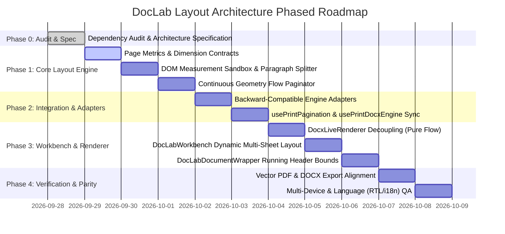
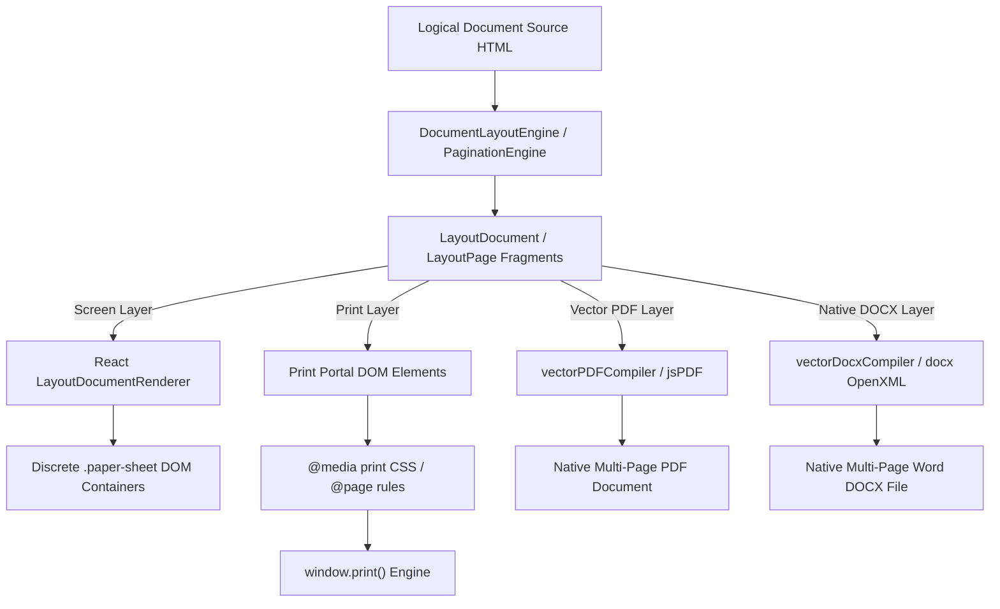

# DocLab Enterprise Layout Architecture Audit & Technical Specification

**Version:** 1.0.0-PROD  
**Document Classification:** Enterprise Architecture Specification  
**Subsystem:** Universal Print Studio & DocLab Engine (`frontend/src/components/print/`)  
**Target Goal:** Geometry-Driven Continuous Document Flow & Runtime Pagination Architecture

---

## Executive Summary

DocLab and Universal Print Studio constitute the core document generation, preview, editing, and publishing platform for the SPR Note enterprise system. This subsystem powers critical institutional documents—including multi-page student transcripts, tabulation ledgers, examination attendance sheets, admit cards, desk slips, institutional reports, and custom OpenXML Word (.docx) templates.

This document presents a comprehensive **Phase 0 Architecture Audit** of all existing pagination systems, template transformations, DOM mutations, export pipelines, and data flows within DocLab. It details identified architectural liabilities, defines a clean target geometry-driven layout architecture, and outlines a phased, non-destructive migration roadmap.

---

## 1. System Dependency Graph & Consumer Matrix

### 1.1 Internal Subsystem Topology (`frontend/src/components/print/`)

```
frontend/src/components/print/
├── UniversalPrintStudio.tsx           # Master Modal Orchestrator & Portal
├── types.ts                           # Subsystem Type Definitions & Contracts
├── printEngine.css                    # Paged Media CSS & Sheet Design System
├── docxTemplateEngine.ts              # Word Import, OpenXML CSS Parser & Template Store
├── docLabDirectiveEngine.ts           # Token Parser, Iteration Directives (#each, #filter)
├── docLabExportUtils.ts               # Exporter Hub (Print, PDF, Word, Excel, Images)
├── vectorDocxCompiler.ts              # OpenXML .docx Compiler (docx library)
├── vectorPDFCompiler.ts               # True Vector PDF Compiler (jsPDF + AutoTable)
├── caretInsertManager.ts              # Caret Offset & Bookmark Insertion Bridge
├── scopeTemplateStore.ts              # Scope-Based Default Template Registry
├── svgShapeTemplates.ts               # Vector Shape Library for Custom Documents
├── components/
│   ├── DocLabHeader.tsx               # Top Studio Action Bar & Export Triggers
│   ├── DocLabWorkbench.tsx            # Canvas Host & Paper Sheet Render Orchestrator
│   ├── sidebar/                       # Configuration Drawer (Templates, Layout, Tokens)
│   └── index.ts                       # Component Barrel
├── hooks/
│   ├── usePrintStudioState.ts         # Core Studio State, Zoom, Pan, History (Undo/Redo)
│   ├── usePrintDocxEngine.ts          # Word Template Parsing, Merging, Auto-save & Mode State
│   ├── usePrintPagination.ts          # Row-Count Based Tabular Slicing Hook (Legacy Native)
│   ├── usePrintStudioShortcuts.ts     # Keyboard Navigation & URL History Sync
│   └── index.ts                       # Hooks Barrel
├── keyLibrary/                        # Document Scope Taxonomies & Placeholder Tokens
└── layout/                            # [NEW] Enterprise Geometry Layout Architecture
    └── DOCLAB_LAYOUT_ARCHITECTURE.md  # Architectural Audit & Specification (This Document)
```

### 1.2 Upstream Consumer Modules

| Consumer Module | Path | Mode Used | Primary Document Types |
| :--- | :--- | :--- | :--- |
| **Print Studio Hub** | `modules/print-studio/PrintStudioHubView.tsx` | Universal / Template | All Scopes, Custom Design |
| **Student Marksheet** | `modules/examinations/mark-sheet/student-marksheet/` | Single Record Multi-Subject | Academic Transcripts, Marksheets |
| **Tabulation Ledger** | `modules/examinations/mark-sheet/tabulation-ledger/` | Batch Tabular Grid | Master Examination Ledgers |
| **Mark Entry Modal** | `modules/examinations/mark-sheet/mark-entry/` | Tabular Grid | Score Rosters & Verification Sheets |
| **Admit Cards** | `modules/examinations/hall-logistics/admit-cards/` | Multi-Record Batch Pages | Hall Passes, Candidate ID Cards |
| **Desk Slips** | `modules/examinations/hall-logistics/seat-plan/` | Multi-Record Grid | Examination Seat Stickers |
| **Hall Attendance** | `modules/examinations/hall-logistics/attendance-sheets/` | Tabular Ledger | Examination Attendance Ledgers |
| **Subject Routine** | `modules/examinations/exam-schedules/subject-routine/` | Quick Document Modal | Exam Schedules, Timetables |
| **Daily Progress** | `modules/learning/progress-management/daily-progress/` | Quick Report Modal | Student Progress Sheets |

---

## 2. Current Architecture & Data Flow Analysis

DocLab currently supports 4 rendering and layout paths depending on the document mode:



---

## 3. Deep Audit of Existing Pagination & Layout Mechanisms

### 3.1 Mechanism A: `DocxLiveRenderer` (In-DOM Live Splitter)
- **Location:** `frontend/src/components/print/DocxLiveRenderer.tsx` (Lines 301–453, 486, 504)
- **Mechanism:**
  - `autoPaginateOverflowInDom(root, pageHeightPx)` runs on debounced `handleInput` (280ms) and `handlePaste` (40ms).
  - Measures DOM elements via `getBoundingClientRect()`.
  - When an element's bottom exceeds `currentPageTop + pageHeightPx`, it invokes `splitParagraphAtHeight(pEl, maxBottom)`.
  - `splitParagraphAtHeight` creates a text `Range`, steps through character offsets in 6-character increments, finds the overflow boundary, extracts the overflow via `postRange.extractContents()`, and physically inserts `<div class="spr-page-break">` and the newly formed paragraph `p2` directly into `root` (`contentEditable`).
- **Valuable Aspects:**
  - Real geometry inspection via DOM bounding boxes.
  - Clean text offset calculation and sub-range extraction without destroying DOM character integrity.
- **Architectural Defects & Risks:**
  - **Content Mutation / Pollution:** Injects runtime layout break markers (`<div class="spr-page-break">`) directly into the document content stream.
  - **Non-Reversible Layout State:** If margins, orientation, paper size, or font sizes change, previously injected page breaks remain baked into the document HTML.
  - **Export Inconsistency:** Exporting to DOCX or plain HTML exports the internal break HTML artifacts.

### 3.2 Mechanism B: `docxTemplateEngine` (Heuristic Template Splitter)
- **Location:** `frontend/src/components/print/docxTemplateEngine.ts` (Lines 136–350)
- **Functions:**
  - `splitHtmlIntoPages(rawHtml)`: String-splits HTML by `<!-- spr-page-break -->`, `<div class="spr-page-break">`, or `<section class="docx">`.
  - `autoPaginateHtmlSection(htmlSection, maxPageHeightPx)`: Estimates element heights using static heuristics (`trs.length * 36 + 16`, `lineCount * 22 + 12`, `h1-h6: 44px`).
  - `joinPagesIntoHtml(pages)`: Joins page strings using `\n<!-- spr-page-break -->\n`.
- **Valuable Aspects:**
  - Provides basic multi-page separation for initial document parsing and legacy imports.
  - Supports repeating `<thead>` headers when splitting tables across heuristic slices.
- **Architectural Defects & Risks:**
  - **Inaccurate Heuristics:** Fails when fonts, line heights, paddings, nested elements, or multi-line table cells diverge from the hardcoded pixel estimates.
  - **Non-Dynamic:** Does not measure actual rendered font metrics or container constraints.

### 3.3 Mechanism C: `usePrintPagination` (Native Tabular Slicer)
- **Location:** `frontend/src/components/print/hooks/usePrintPagination.ts` (Lines 1–133)
- **Mechanism:**
  - Calculates fixed row counts per page: `LEGAL: 28 rows`, `LETTER: 22 rows`, `A4: 25 rows`, adjusted by density (`COMPACT: +8`, `SPACIOUS: -6`).
  - Slices `liveData` array into `PrintPaginationPage[]`.
- **Valuable Aspects:**
  - High performance and deterministic for standard uniform tabular records.
  - Fully integrated with visible row filters, mandatory row rules, and extra blank rows.
- **Architectural Defects & Risks:**
  - Assumes uniform row height. Fails when individual rows contain long notes, badges, multiple wrapped lines, or custom cell renderers.

---

## 4. Audit of Template Transformations & Data Merging

The template pipeline transforms template markup through the following lifecycle:

```
[Imported Word .docx Binary]
           ↓ (mammoth.js / docx-preview)
[Raw OpenXML HTML & Stylesheet]
           ↓ (separateDocxStylesAndBody)
[Template Body with Tokens: {{student_name}}, {{#each subjects}}]
           ↓
    ┌───────────────────────────────────────────────┐
    │ Mode Selection (docxRenderMode)               │
    ├───────────────────────┬───────────────────────┤
    │ 'template' Mode       │ 'sample' / 'all' Mode │
    │ (Design & Structure)  │ (Data Population)     │
    └───────────┬───────────┴───────────┬───────────┘
                ↓                       ↓
     [Continuous Source Model]   [mergeTemplateWithData / bulkMergeTemplate]
                ↓                       ↓
     [Pure Template Body]        [Enriched HTML Strings per Record/Batch]
                ↓                       ↓
     [Geometry Layout Pass]      [Geometry Layout Pass]
                ↓                       ↓
     [Visual Page Fragments]     [Visual Page Fragments]
```

### 4.1 HTML Mutation Inspection Points
1. `DocxLiveRenderer.tsx` (Typing / Input handler): Mutates DOM via `execCommand('insertHTML')` and `autoPaginateOverflowInDom`.
2. `DocLabWorkbench.tsx` (Template updater): Updates `customDocxTemplate.body` and `templateBody` on input.
3. `DocxFormattingRibbon.tsx` (Rich formatting toolbar): Applies inline formatting (`bold`, `italic`, `fontSize`, `insertHTML`).
4. `caretInsertManager.ts` (Token insertion): Inserts placeholder tokens at active DOM selection ranges.

### 4.2 Page Boundary Persistence Inspection Points
1. `localStorage` key `spr_custom_docx_templates`: Persists `CustomDocxTemplate` objects.
2. `usePrintDocxEngine.ts` line 882: Combines page fragments into a single string via `pages.join('\n<!-- spr-page-break -->\n')`.
3. `docxTemplateEngine.ts` line 384: `joinPagesIntoHtml(pages)`.

### 4.3 Consumers of `mergedDocxPages`
1. `UniversalPrintStudio.tsx`:
   - Line 220: Passes `mergedDocxPages` to `handleExportWord` (`customPages`).
   - Line 339: Computes total page count for `DocLabHeader`.
   - Line 411: Passes `mergedDocxPages` to `DocLabWorkbench`.
2. `DocLabWorkbench.tsx`:
   - Line 380: Renders discrete paper sheets in `sample` or `all` mode (`mergedDocxPages.map((pageHtml, pIdx) => ...)`).
3. `usePrintDocxEngine.ts`:
   - Line 539: Computes memoized `mergedDocxPages` based on template, records, and render mode.
   - Line 881: Uses `mergedDocxPages` to assemble generated document payloads.

### 4.4 Manual Page-Break Behavior
- **Shortcut:** `Ctrl + Enter` or `Cmd + Enter` inside `DocxLiveRenderer.tsx` (Line 518).
- **Workbench Action:** `+ Add Page` button in `DocLabWorkbench.tsx` (dispatches `spr_doclab_insert_page_break`).
- **Ribbon Action:** Page Break icon in `DocxFormattingRibbon.tsx` (Line 222).
- **Semantics:** Manual page breaks are user-intended structural document breaks and must always be preserved as explicit `data-manual-break="true"` markers.

---

## 5. Render & Export Pipeline Parity Matrix

| Pipeline | Engine / Library | Current Pagination Source | Target Architecture Parity Source |
| :--- | :--- | :--- | :--- |
| **Screen Canvas** | React DOM + `DocLabCanvasViewer` | DOM split / string split | `DocLabLayoutEngine` Page Fragments |
| **Browser Print** | Native `window.print()` + `@page` | CSS page-break + sheet DOM | `DocLabLayoutEngine` Printed Sheets |
| **Vector PDF** | `jspdf` + `jspdf-autotable` | AutoTable pagination / html2canvas | Shared `PageLayoutMetrics` & Fragments |
| **Native DOCX** | `docx` OpenXML Compiler | String split / table rows | Native `w:br w:type="page"` & `w:tblHeader` |
| **Image Export** | `html2canvas-pro` | Per-sheet DOM capture | Discrete Page Fragment DOM Nodes |

---

## 6. Identified Deficiencies, Duplications & Legacy Couplings



1. **Content Mutation via DOM Injection:** In `DocxLiveRenderer.tsx`, auto-pagination permanently modifies the user's content by splitting text and adding DOM tags.
2. **Duplicated String Splitting Logic:** Multiple files independently execute regex splits on `spr-page-break` and `<!-- spr-page-break -->`.
3. **Missing Repeating Table Headers on Screen:** Dynamic table splits in standard custom template mode do not clone `<thead>` on subsequent pages on screen.
4. **Lack of Orphan/Widow and Keep-With-Next Protection:** Headings (`<h1>`–`<h6>`) can land as the final element of a page without their following content block.
5. **No Measurement-Aware Available Content Space Calculation:** The printable content area height must dynamically subtract actual measured heights of the running header, metadata grid, and signature block.

---

## 7. Proposed Target Architecture: Geometry Layout Engine

### 7.1 Core Layout Subsystem Architecture (`layout/`)

```
frontend/src/components/print/layout/
├── types.ts                   # Layout Contracts, Page Metrics, Node Fragment Types
├── pageMetrics.ts             # Exact Physical & Pixel Dimensions for A4/Letter/Legal/Margins
├── domMeasureUtils.ts         # High-Performance Offscreen Measurement Sandbox
├── geometryPaginator.ts       # Continuous Flow Slicer (Tables, Paragraphs, Images, Keep-Together)
├── tabularPaginator.ts        # Dynamic Variable-Height Tabular Data Paginator
├── paragraphSplitter.ts       # Sub-Node Character Range Text Fragmentation Engine
└── index.ts                   # Unified Layout Module Exports
```

### 7.2 Data Flow in Target Architecture



### 7.3 Key Guarantees of Target Architecture
1. **Continuous Source Integrity:** Document body HTML in state/storage remains 100% pure continuous markup with zero auto-generated break pollution.
2. **Dynamic Geometry:** Pages are computed dynamically at runtime using real browser rendering geometry and font metrics.
3. **Table Header Replication:** Split tables automatically clone and repeat their `<thead>` across all subsequent page fragments.
4. **Variable Row Height Support:** Rows of any arbitrary height are cleanly allocated without overlapping or clipping.
5. **Keep-With-Next Protection:** Headings and labeled sections never appear orphaned at the bottom of a page.
6. **Decoupled Running Headers & Footers:** Document headers, metadata grids, signatures, and runtime page numbers (`Page X of Y`) reside in reserved page zones.
7. **Multi-Format Export Parity:** Screen canvas, Browser Print, Vector PDF, and Native DOCX share the same logical layout results.

---

## 8. Phased, Non-Destructive Migration Plan



### Phase Breakdown
- **Phase 0 (Complete):** Comprehensive system audit and documentation of all pagination, transformation, and export flows.
- **Phase 1 (Layout Core):** Build `frontend/src/components/print/layout/` sub-modules containing pure geometry calculations, page metrics, DOM measurement sandboxing, and non-destructive paragraph/table fragmenting.
- **Phase 2 (Adapters):** Connect `docxTemplateEngine.ts` and `usePrintDocxEngine.ts` to the layout engine via backward-compatible adapters without breaking existing callers.
- **Phase 3 (Workbench & Renderers):** Decouple `DocxLiveRenderer.tsx` from in-DOM auto-pagination while preserving caret bookmarking and manual break handling; update `DocLabWorkbench.tsx` and `DocLabDocumentWrapper.tsx`.
- **Phase 4 (Export Parity & QA):** Ensure 100% layout fidelity across Vector PDF, Native DOCX, Native Print, and multiple languages/orientations.

---

## 9. Multi-Target Layer Separation Architecture (Screen, Print, PDF, DOCX)

> [!IMPORTANT]
> **Screen Pagination and Print Pagination are fundamentally different layers.**
> Do **NOT** expect CSS `page-break-after` alone to create or dictate screen pages.
> The layout engine (`LayoutDocument`) is the single source of truth for all target layers.

### 9.1 Architecture Pipeline per Target Layer



### 9.2 Layer Responsibilities

1. **Screen Layer:**
   - `React` -> `LayoutDocument` -> `LayoutDocumentRenderer` -> `LayoutPageRenderer` -> Discrete `.paper-sheet` elements.
   - Screen pagination creates independent physical DOM sheets with exact CSS width/height (`794px × 1123px` for A4 portrait), `overflow: hidden`, and clean gap separation (`gap: 2rem`).
   - Zero reliance on CSS printing hacks to slice screen pages.

2. **Browser Print Layer:**
   - `LayoutDocument` -> `#universal-print-portal` DOM -> `@media print` CSS.
   - `@media print` rules apply `page-break-inside: avoid; break-inside: avoid; page-break-after: always; break-after: page;` to each discrete paper-sheet.
   - Dynamic `@page` CSS rule configures physical paper size and margins.

3. **Vector PDF Layer:**
   - `LayoutDocument` -> `compileVectorPDFDocument` (`jspdf` + `jspdf-autotable`).
   - Constructs vector PDF pages using `doc.addPage()` with exact geometry margins, headers, and footers (`Page X of Y`).

4. **Native DOCX Layer:**
   - `LayoutDocument` -> `compileCanvasToNativeDocx` / `compileNativeDocxDocument` (`docx` OpenXML library).
   - Translates page fragments into native OpenXML `Paragraph` with `pageBreakBefore: true` and document headers/footers (`PageNumber.CURRENT` / `PageNumber.TOTAL_PAGES`).

---

## 10. Explicit Boundary: DocLab Custom Document vs Native Tabular Print

To ensure 100% stability and backward compatibility across standard data tables and custom document templates, the system maintains two explicitly separated pipelines:

```
Mode 1: DocLab Custom Document Mode (Rich Word / Freeform Templates)
    ↓
Geometry Layout Engine (PaginationEngine / DocumentLayoutEngine)
    ↓
Real Visual Pages (LayoutPageRenderer / LayoutDocumentRenderer)

Mode 2: Native Tabular Print Mode (System Reports, Ledgers, Data Grids)
    ↓
Existing Table Pagination (usePrintPagination.ts)
    ↓
Structured Table Pages (DocLabTableRenderer / DocLabDocumentWrapper)
```

### 10.1 Invariants Maintained
1. **Zero Regression for `usePrintPagination.ts`:** Structured tabular reports (e.g. fee registers, mark sheets, attendance sheets, staff rosters) continue to leverage deterministic row-based pagination (`rowsPerPage` by page size & density, blank row padding).
2. **Explicit Mode Dispatch:** `DocLabWorkbench.tsx` dispatches to `LayoutDocumentRenderer` only when `customDocxTemplate` is active, and cleanly delegates to `paginationResult.pages` from `usePrintPagination` when rendering structured data columns and rows.
3. **Clean Type Contracts:** `PrintPaginationResult` and `PaginationEngineResult` maintain distinct, strongly-typed contracts to prevent state cross-contamination.


